# 🚲 VeloSpot

**Find bike parking spaces across Germany 🇩🇪, France 🇫🇷 and Luxembourg 🇱🇺**


[](https://github.com/drzeeb/VeloSpot/releases/latest)
[](https://github.com/drzeeb/VeloSpot/actions/workflows/ci.yml)
[](https://github.com/drzeeb/VeloSpot/actions/workflows/release.yml)
[](https://github.com/drzeeb/VeloSpot/actions/workflows/android-lint.yml)
[](https://scorecard.dev/viewer/?uri=github.com/drzeeb/VeloSpot)
[](https://codecov.io/gh/drzeeb/VeloSpot)

VeloSpot is an Android application that helps cyclists discover and navigate to bike parking facilities **across Germany, France and Luxembourg**. Powered by a pre-bundled OpenStreetMap dataset with over **100 000 locations**, the app works fully offline from the very first launch — no network required to find parking.

## 🗺️ Multi-Country Bike Parking Data

VeloSpot ships with pre-bundled OpenStreetMap extracts covering **Germany 🇩🇪, France 🇫🇷 and Luxembourg 🇱🇺**.

- **~100 000+ bicycle parking locations** extracted from the OSM datasets for Germany, France and Luxembourg
- **Fully offline** — all data is bundled inside the app as a Room/SQLite asset (one DB per country, merged on first launch)
- **Instant startup** — no network call needed to see parking spots
- **Viewport-based loading** — only the markers visible in the current map area are queried, keeping memory usage low even with 100 000+ entries
- **Marker clustering** — at city-level zoom dense areas are aggregated into native MapLibre clusters for smooth panning and zooming; tapping a cluster zooms in to break it apart
- **Lazy reverse geocoding** — when you tap a marker without a stored address, Nominatim is queried once, the result is cached locally and shown immediately in the details sheet
- **Extraction script included** (`scripts/extract_osm_parking.py`) — regenerate the bundled database from a fresh Geofabrik PBF at any time

## 🔗 Quick Links

- **Website**: https://velospot.app
- **GitHub Repository**: https://github.com/drzeeb/VeloSpot
- **Privacy Policy**: https://velospot.app/privacy.html ([`PRIVACY.md`](./PRIVACY.md))
- **Legal Notice (Impressum)**: https://velospot.app/imprint.html ([`IMPRINT.md`](./IMPRINT.md))
- **Changelog**: [`CHANGELOG.md`](./CHANGELOG.md)
- **Licensing & Attribution**: [ATTRIBUTIONS.md](ATTRIBUTIONS.md)

## ✨ Highlights

- **Multi-country** bike parking data from OpenStreetMap (~100 000+ locations across Germany, France and Luxembourg)
- **Fully offline** after install — no network calls required to find parking
- OpenStreetMap-based map browsing with **MapLibre vector tiles** and custom bike markers
- Viewport-based marker loading — smooth performance even across whole countries
- **Marker clustering** — nearby parking pins are merged into clusters at low zoom for a fast, uncluttered map; tap a cluster to zoom in
- Lazy address resolution via Nominatim (cached permanently to local DB)
- Red marker highlighting for favorite parking spots
- Orange marker highlighting for currently selected parking space
- Dedicated favorites sheet with direct navigation shortcuts
- Smooth animated map camera transitions powered by MapLibre's built-in easing
- Current-location recentering and location marker support
- In-app dark mode toggle from the top-right menu — **including dark map tiles** that turn the whole vector map dark
- **🆕 Toggle map layers** — show or hide pin categories (parking, favorites, saved places) from an intuitive layers sheet; the choice is persisted
- **🆕 Saved places** — save any tapped location as a named favorite; it appears as a persistent green star marker and in the favorites list
- **In-app bike route navigation** with live route overlay (no external map app handoff)
- **🆕 Live 3D turn-by-turn navigation** — a Google-Maps-style 3D follow camera (60° pitch, heading-up, speed-dependent zoom), snap-to-route map matching, a rotating heading arrow, live remaining-distance/ETA, a greyed-out travelled path, 3D buildings, and automatic off-route rerouting
- **🆕 2D / 3D map view switch** — choose a flat top-down map or a tilted 3D view (with extruded buildings) for the resting map; the choice is persisted. Navigation itself is always 3D
- **Navigation focus mode**: non-target parking markers become smaller, lighter gray, and more transparent while navigation is active
- **8 languages** with persistent in-app language picker (DE 🇩🇪 EN 🇬🇧 FR 🇫🇷 IT 🇮🇹 PT 🇵🇹 LB 🇱🇺 NL 🇳🇱 ES 🇪🇸)
- **🆕 Address search** — type any address in Germany, France or Luxembourg into the floating search bar and jump straight to the location; results are biased toward your current surroundings. Tap a result to drop a pin and start in-app BRouter navigation, save it as a favourite, or remove the pin (same sheet as a custom pin)
- **🆕 Tap-to-place custom pin** — tap any empty spot on the map to drop a blue pin; the address is resolved automatically via Nominatim reverse geocoding and a bottom sheet lets you start navigation directly to that point
- **🆕 BRouter offline routing** — routes calculated entirely on-device with 5 cycling profiles; no internet needed after the one-time segment download
- **🆕 Round-trip generator** — pick a target distance (5–50 km) and BRouter builds a circular loop that starts and ends at your position
- **🆕 Spoken turn-by-turn voice guidance** — optional Text-to-Speech reads the upcoming turns aloud, with a *prepare*, *now* and *arrival* cue
- **🆕 Route hilliness slider** — trade a little distance for flatter offline routes (five levels, applied live)
- **🆕 Record your rides** — the "My rides" timeline captures time, distance, speed, elevation and a speed chart; recording keeps running in the background with a notification, a Quick Settings tile and a home-screen widget
- **🆕 Named rides + GPX export/import** — rides are auto-named after the destination (round trips become "Round trip – place"); a prompt names manual recordings; export selected rides as GPX (share or save to a file) and import GPX back in
- **🆕 Ride statistics dashboard** — totals, averages, personal records, streaks and fun facts (CO₂ saved, calories), all computed on-device
- **🆕 Ride heatmap & "Ridden tracks" layers** — see where you cycle most as a colour heatmap, or draw every recorded ride as a thin line
- **🆕 Share a ride** — export a recorded ride as a slick "VeloSpot Wrapped" card for WhatsApp, Telegram & Instagram
- **🆕 Pedalling cyclist avatar** — your live-location marker visibly pedals while you ride and plants a foot on the ground when you stop
- **🆕 Find my bike** — save where you parked (auto-saved on navigation arrival) and navigate back to it later
- **🆕 Plan, save & re-ride multi-waypoint routes** — build custom routes tap by tap, save them, and race your own **personal leaderboard** (a separate board for the forward and reversed direction), with a map preview and a per-direction digest of your best/average times
- **🆕 Bike garage** — keep a profile per bike (name, brand, type, tyre size, weight…), see your ride history broken down per bike, and get one-time km-based **service reminders**
- **🆕 Detailed ride analysis** — a full-screen analysis with an **animated map replay**, per-kilometre splits, categorised climbs, **best efforts** (fastest 1–100 km / furthest 1–60 min) and earned **achievement badges**
- **🆕 Share any spot** as a universal OpenStreetMap link from the detail sheets
- **🆕 Keep screen on** while navigating and recording (toggle); **accessibility** (TalkBack) improvements; legal notice (Impressum) in-app and on the website

## 🌟 Features

- 🔍 **Address Search** - Type any address in Germany, France or Luxembourg into the top search bar; get up to 5 geocoded suggestions (biased to your surroundings) and navigate directly to the result
- 📌 **Tap-to-Place Pin** - Tap any empty spot on the map to drop a custom blue pin; Nominatim reverse geocoding resolves the address automatically and a bottom sheet lets you start navigation directly to that point
- 🌍 **Germany, France & Luxembourg** - 100 000+ bike parking spots from OpenStreetMap, bundled offline
- 📍 **Interactive Map** - Browse bike parking spaces on an interactive **MapLibre vector tile** map
- ⚡ **Viewport Loading** - Only the visible map area is queried; scroll across whole countries without slowdowns
- 🧊 **Marker Clustering** - At city-level zoom, dense parking pins are aggregated into clusters for a fast, uncluttered map; tap a cluster to zoom in and break it apart
- 🏠 **Offline-First** - All parking data is available instantly, even without a network connection
- 📬 **Address Lookup** - Missing addresses are resolved via Nominatim and cached locally on first tap
- 🎬 **Smooth Animations** - Fluid zoom and pan transitions powered by MapLibre's native camera engine
- 🗺️ **Vector Tiles** - Sharp, smooth map rendering at every zoom level via [OpenFreeMap](https://openfreemap.org/) Liberty style (no API key required)
- 🧭 **My Location** - Center the map on your current position and display a live location marker
- ❤️ **Favorites** - Save frequently used bike parking spots and use dedicated actions for navigation or spot details
- ⭐ **Selected Highlight** - See your current selection highlighted with an orange marker
- 🌙 **Dark Mode Toggle** - Switch the app theme directly from the in-app menu — the map also switches to a bundled dark vector-tile style (reusing the same OpenFreeMap tiles) with higher-contrast markers
- 🗂️ **Toggle Map Layers** - Show or hide each pin category independently (parking spots, favorites, saved places) via a layers sheet; the selection is remembered across restarts
- ⭐ **Saved Places** - Save any tapped location as a named favorite; saved places appear as persistent green star markers and in the favorites list with navigate and show-on-map actions
- 🌐 **8 Languages** - Choose from German, English, French, Italian, Portuguese, Luxembourgish, Dutch, and Spanish; the selection is remembered across restarts
- 💾 **SQLite Offline Database** - All ~100 000 parking locations are bundled as a Room asset; no sync required
- 🎯 **In-App Navigation** - Calculate bike routes directly inside the app and render the route path on the map
- 🧭 **Live 3D Navigation** - A Google-Maps-style 3D follow camera (fixed 60° pitch, heading-up rotation, speed- and turn-dependent zoom) with snap-to-route map matching, a rotating heading arrow, live remaining-distance + ETA, a greyed-out travelled path, extruded 3D buildings, and automatic off-route rerouting via BRouter
- 🧱 **2D / 3D Map View** - Switch the resting map between a flat top-down view and a tilted 3D view with 3D buildings from a sleek segmented selector; the choice is remembered. Active navigation always uses the full 3D camera
- 👁️ **Navigation Focus** - During active navigation, non-target markers are dimmed to keep the destination visually prominent
- 📊 **Detailed Information** - View capacity, address, and operator for each location
- 🎨 **Modern UI** - Clean and intuitive Jetpack Compose-based interface

## 📱 Target Platform

- **Android 8.0 (API 26)** and above
- Minimum: API 26 | Target: API 37

## 📸 Screenshots

| Map overview | Dark map mode | Map layers |
| :---: | :---: | :---: |
| 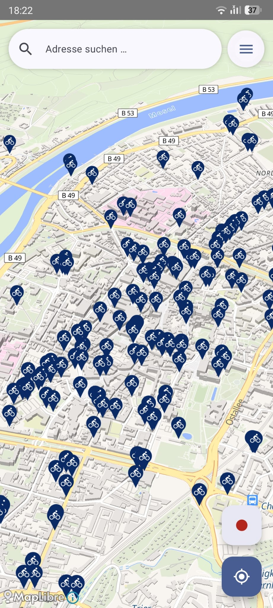 | 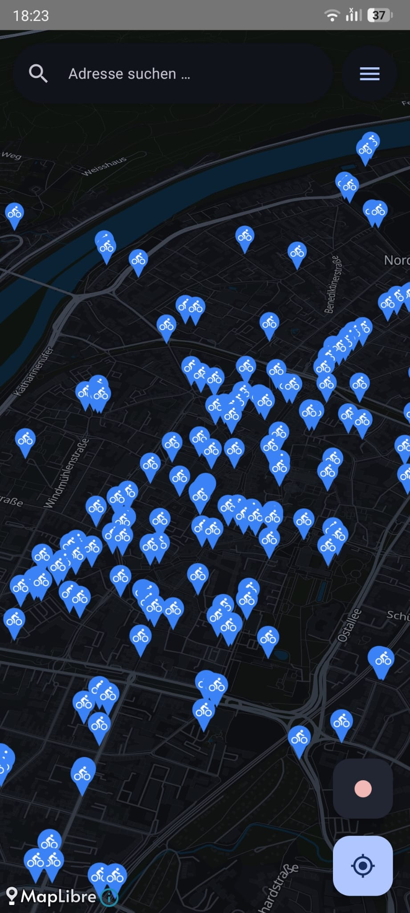 | 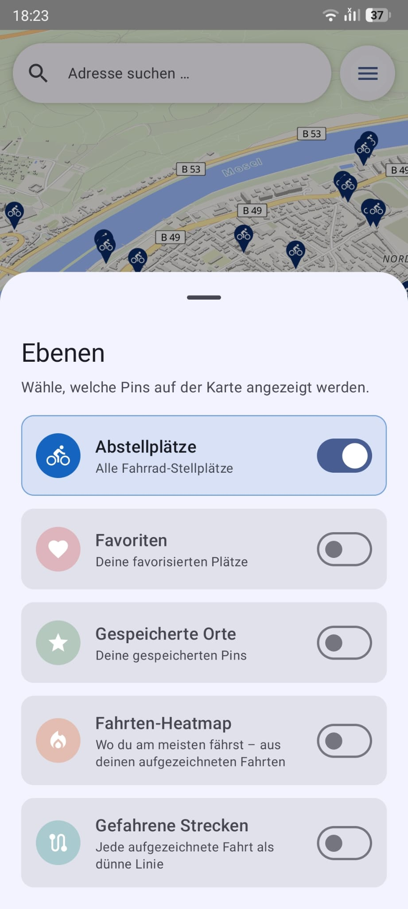 |
| **Address search** | **Found location** | **Parking details** |
| 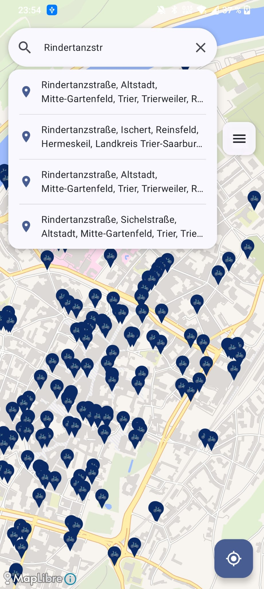 | 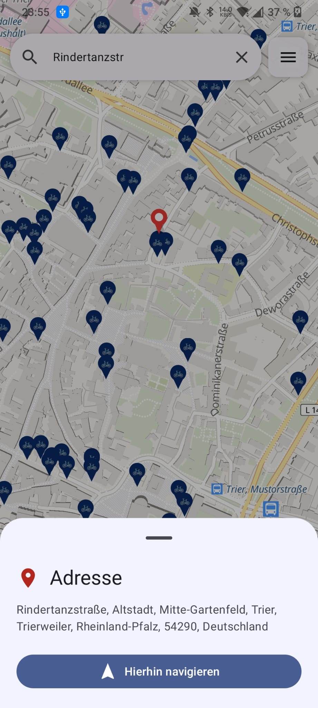 | 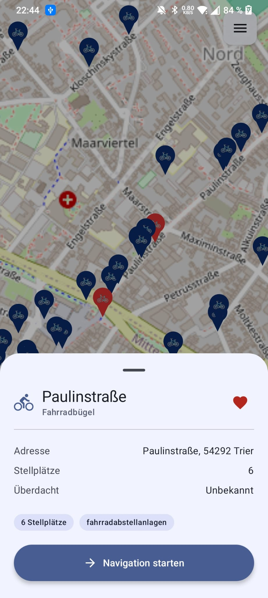 |
| **Favorites** | **2D / 3D map view** | **Bike routing profiles** |
| 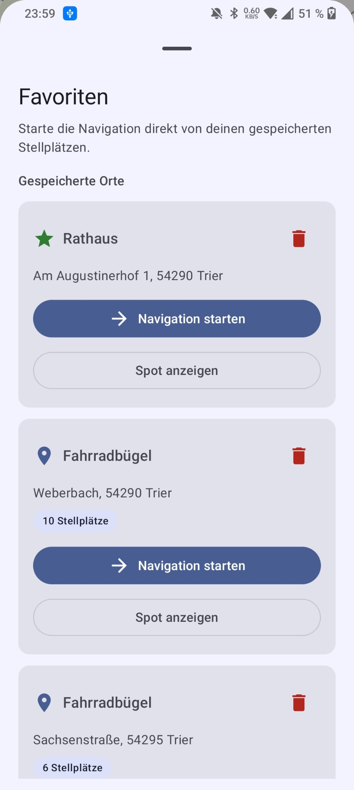 | 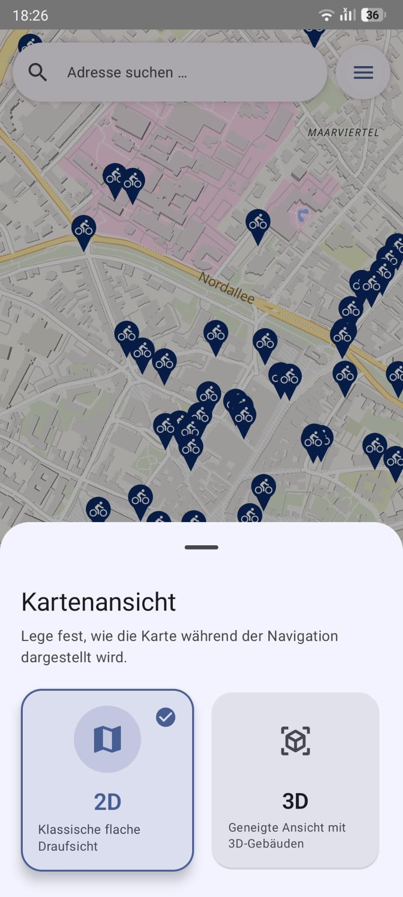 | 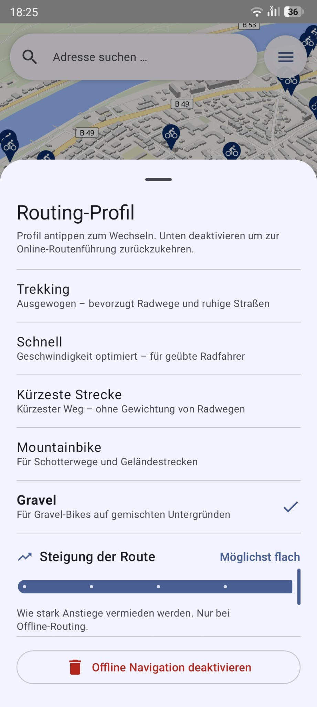 |
| **Round trip** | **Ride tracking** | **Settings** |
| 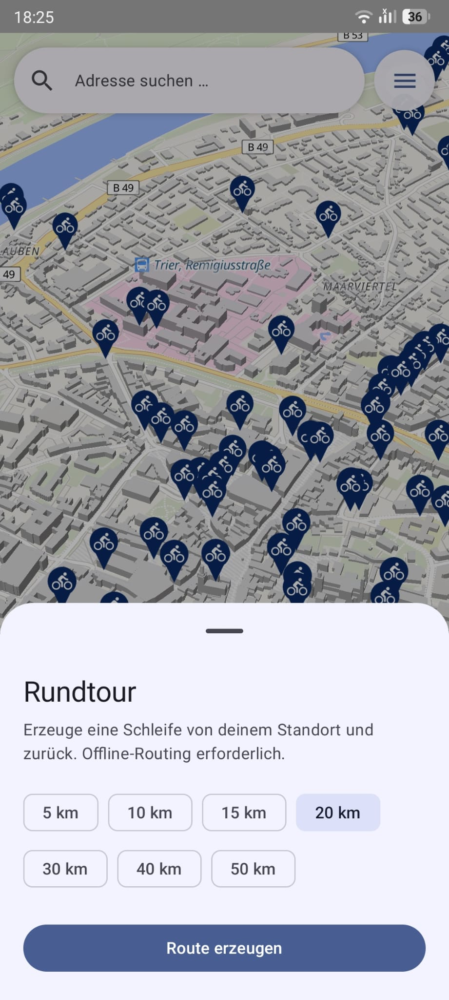 | 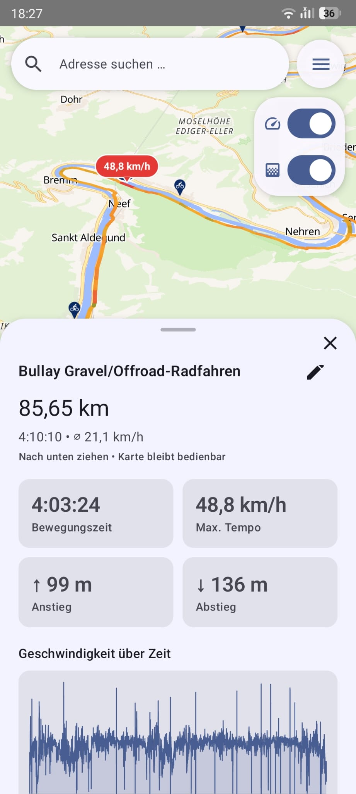 | 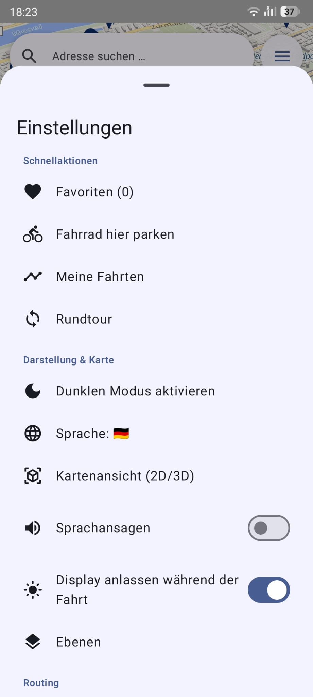 |

> More screenshots and a live feature overview are on the [GitHub Pages site](https://drzeeb.github.io/VeloSpot/).

## 🛠 Tech Stack

- **Language**: Kotlin
- **UI Framework**: Jetpack Compose
- **Architecture**: Clean Architecture with MVVM
- **Dependency Injection**: Hilt
- **Data**: Retrofit, Moshi, Room (SQLite asset DB), **MapLibre** (vector tile map rendering)
- **Map Style**: [OpenFreeMap](https://openfreemap.org/) Liberty (free, no API key required)
- **Navigation**: BRouter offline routing + a custom `NavigationManager` (Choreographer-driven 3D follow camera, snap-to-route map matching, `fill-extrusion` 3D buildings)
- **Geocoding**: Nominatim REST API (lazy, on-demand, cached)
- **Routing**: BRouter (on-device, offline) with OSRM online fallback
- **Location**: Android runtime permissions — `FusedLocationProviderClient` (Google Play flavor) / `LocationManager` (F-Droid flavor)
- **Build System**: Gradle
- **Data Pipeline**: Python + pyosmium (`scripts/extract_osm_parking.py`)

## 🗂 Project Structure

```
VeloSpot/
├── app/
│   ├── src/
│   │   ├── main/
│   │   │   │   ├── assets/
│   │   │   │   │   ├── bike_parking_germany.db     # Pre-bundled OSM dataset (~20 MB)
│   │   │   │   │   ├── bike_parking_france.db      # Pre-bundled OSM dataset
│   │   │   │   │   └── bike_parking_luxembourg.db  # Pre-bundled OSM dataset
│   │   │   ├── java/de/velospot/
│   │   │   │   ├── feature/          # Feature modules
│   │   │   │   ├── domain/           # Business logic
│   │   │   │   ├── data/             # Data layer (local DB + geocoding)
│   │   │   │   ├── core/             # Shared utilities
│   │   │   │   └── MainActivity.kt
│   │   │   ├── res/                  # Resources
│   │   │   └── AndroidManifest.xml
│   │   ├── test/                     # Unit tests
│   │   └── androidTest/              # Instrumented tests
│   ├── schemas/                      # Room schema exports (v4)
│   ├── build.gradle.kts
│   └── proguard-rules.pro
├── scripts/
│   ├── extract_osm_parking.py        # PBF → SQLite pipeline
│   └── README.md
├── gradle/
├── build.gradle.kts
├── settings.gradle.kts
└── README.md
```

## 📥 Download

Pre-built debug APKs are available on the [Releases page](https://github.com/drzeeb/VeloSpot/releases/latest).

1. Download the latest `VeloSpot-vX.X.X-debug.apk`
2. On your Android device: **Settings → Install unknown apps** → allow your browser or file manager
3. Open the APK and tap **Install**

New releases are built automatically by GitHub Actions whenever a version tag is pushed.

## 🚀 Getting Started

### Prerequisites

- Android Studio (Jellyfish or newer)
- Java Development Kit (JDK 17+)
- Android SDK 37+
- Git

### Installation

1. **Clone the repository**
   ```bash
   git clone https://github.com/drzeeb/VeloSpot.git
   cd VeloSpot
   ```

2. **Open in Android Studio**
   - File → Open
   - Select the VeloSpot directory
   - Android Studio will automatically detect and configure the project

3. **Build the project**
   ```bash
   ./gradlew build
   ```

4. **Run on device or emulator**
   ```bash
   ./gradlew installDebug
   adb shell am start -n de.velospot/de.velospot.MainActivity
   ```

### Regenerating the Bundled Database

The parking database is pre-generated and committed to `app/src/main/assets/`. To regenerate it from a fresh OSM extract:

```bash
pip install osmium requests
cd scripts/
python extract_osm_parking.py --pbf germany-latest.osm.pbf
# → writes ../app/src/main/assets/bike_parking_germany.db
# repeat with the France and Luxembourg PBFs to refresh those datasets
```

See [`scripts/README.md`](scripts/README.md) for full details on the extraction pipeline, including how to download the per-country PBFs from Geofabrik.

## 📊 Data Sources

VeloSpot bundles bike parking data extracted from OpenStreetMap and displays it on OpenStreetMap tiles:

- **Bike Parking Data**: OpenStreetMap contributors (Germany, France & Luxembourg extracts via [Geofabrik](https://download.geofabrik.de/europe.html))
- **Data format**: Pre-processed SQLite asset (Room-compatible)
- **Update frequency**: Bundled at build time; regenerate with `extract_osm_parking.py` for fresh data
- **Reverse Geocoding**: [Nominatim](https://nominatim.openstreetmap.org/) (on-demand, cached, OSM-based)
- **Map Tiles**: OpenFreeMap vector tiles (Liberty style, [openfreemap.org](https://openfreemap.org/)) rendered via MapLibre
- **Map License**: Open Data Commons Open Database License (ODbL 1.0)
- **Attribution**: © OpenStreetMap contributors

For more information about OpenStreetMap and ODbL, visit:
- OpenStreetMap: https://www.openstreetmap.org/copyright
- ODbL License: https://opendatacommons.org/licenses/odbl/

## 🎨 UI Components

### Map Screen
- Centered map view with bike parking markers
- **Marker clustering** — at low zoom, nearby pins merge into count bubbles; tapping a cluster animates the camera in to its expansion zoom. The selected spot and active navigation destination stay visible on a dedicated non-clustered layer
- **Address search bar** (top of screen) — live Nominatim forward geocoding with 400 ms debounce; results shown in a dropdown; tap a result to drop a pin and open the **same sheet as a custom pin** (`CustomMapPinSheet`) with "Navigate here", "Save as favourite" and "Remove pin" actions
- **Tap-to-place custom pin** — tap any empty map location to drop a blue pin; `CustomMapPinSheet` shows the reverse-geocoded address and a "Navigate here" action; pin remains visible as route end-point during active navigation
- Zoom-responsive marker scaling
- Favorite-aware marker colors
- Current location marker and recenter action
- Top-right quick menu with favorites, language picker, and dark mode toggle
- Menu button and search bar vertically aligned in the same row for a clean, consistent header
- In-app routing polyline, destination highlight, and route status card (distance/time)
- **Live 3D navigation mode** — a tilted (60°) follow camera that snaps the position onto the BRouter route, rotates with the heading, zooms with speed, greys out the travelled path, raises 3D buildings, shows live remaining distance/ETA, and reroutes automatically when you go off-route
- Navigation focus styling that dims non-target markers (smaller, lighter gray, and more transparent)
- Error handling and loading states

### Parking Details Sheet
- Bottom sheet with parking information
- Address auto-resolved via Nominatim if not present in OSM data
- Capacity and operator details when available
- Full-width "Save as favourite" / "Remove from favourites" button
- Quick-access navigation button

### Favorites Sheet
- Dedicated list of saved bike parking spots
- Separate actions per saved location: start navigation or show spot details
- Empty-state guidance for first-time use

### Language Picker
- Flag-based selection for 8 supported languages
- Selection persists across app restarts and cold starts

## 🧪 Testing

Run unit tests:
```bash
./gradlew test
```

### Coverage (Kover)

Generate a JaCoCo-compatible coverage report from the JVM unit tests:

```bash
# XML (used by CI / Codecov)
./gradlew :app:koverXmlReportFdroid
# Human-readable HTML → app/build/reports/kover/htmlFdroid/index.html
./gradlew :app:koverHtmlReportFdroid
```

CI runs the coverage report on every pull request, posts a summary comment and uploads the result to Codecov (see the badge above). Generated code (Hilt, Room) and pure Compose UI are excluded so the figure reflects testable logic.

Run instrumented tests:
```bash
./gradlew connectedAndroidTest
```

## 🔐 CI & Branch Protection

The repository uses GitHub Actions and GitHub Rulesets to enforce safe merges on `main`:

- Required CI checks: `ci-build` and `ci-test`
- Pull requests are required for `main`
- At least one approval is required
- Stale reviews are dismissed on new commits
- Review threads must be resolved
- Non-fast-forward updates and branch deletion are blocked
- Linear history is enforced

Renovate is configured so that only security-related dependency updates can be automerged.

Recent Renovate dependency and tooling updates are documented in [`CHANGELOG.md`](./CHANGELOG.md) under `Unreleased`.

## 🔒 Supply-Chain Security

VeloSpot follows software supply-chain best practices so users and packagers can trust every release:

- **OpenSSF Scorecard** — an automated weekly analysis of the repository's security posture (branch protection, pinned actions, token permissions, …), published as a public badge and to the Security → Code scanning tab (`.github/workflows/scorecard.yml`).
- **Build provenance (SLSA / Sigstore)** — every released APK and SBOM ships with a signed [build-provenance attestation](https://docs.github.com/actions/security-guides/using-artifact-attestations). Verify any artifact with:
  ```bash
  gh attestation verify VeloSpot-vX.Y.Z.apk --repo drzeeb/VeloSpot
  ```
- **SBOM (CycloneDX)** — a full Software Bill of Materials (`*-sbom.cdx.json` / `.xml`) listing every dependency and license is attached to each release. Regenerate locally with:
  ```bash
  ./gradlew :app:cyclonedxDirectBom   # → app/build/reports/cyclonedx/bom.json + bom.xml
  ```
- **Reproducible F-Droid builds** — the F-Droid flavor is byte-for-byte reproducible (VCS info and AGP dependency-metadata blocks are stripped from the APK).
- **CodeQL & Dependency Review** — static analysis and dependency vulnerability checks run on every pull request.

## 🔧 Configuration

### Network Timeout
Edit `core/di/NetworkModule.kt` to adjust API request timeouts.

### Default Map Location
Modify constants in `feature/map/presentation/MainMapScreen.kt`:
```kotlin
private const val TRIER_LAT = 49.7596
private const val TRIER_LON = 6.6441
private const val DEFAULT_ZOOM = 14.0
```

## 📦 Build & Release

### Debug Build
```bash
./gradlew assembleDebug
```

### Release Build
```bash
./gradlew assembleRelease
```

Generated APK location: `app/build/outputs/apk/`

## 🗒 Changelog

Project history and notable milestones are documented in [`CHANGELOG.md`](./CHANGELOG.md).

## 🐛 Troubleshooting

### Build fails with "JAVA_HOME not set"
```bash
# On Windows
set JAVA_HOME=C:\Program Files\Android\Android Studio\jbr
```

### App crashes on startup
- Ensure location permissions are granted
- Check that the asset database `bike_parking_germany.db` is present under `app/src/main/assets/`

### No parking markers visible after fresh install
- On the very first launch Room copies the ~20 MB asset database — this takes a second or two; wait briefly and the markers will appear
- If upgrading from a previous version: uninstall the old app first so Room copies the fresh asset (or use `adb shell run-as de.velospot rm databases/velospot_database.db` on debug builds)

### Map shows blank
- The MapLibre map style is loaded from [OpenFreeMap](https://openfreemap.org/) on first launch — a brief internet connection is required to cache the vector tile style
- After the style is cached, the map renders offline; only tile data for new map areas requires a network call
- No API key or registration is required

### My Location does not work
- Confirm location permission is granted for the app
- Make sure location services are enabled on the device
- Try tapping the floating action button again after Android shows the permission dialog

### Address shows "—" for a parking spot
- Address resolution happens the first time you tap a marker; it requires a brief network call to Nominatim
- After the first tap the address is cached permanently in the local database

### Address search returns no results
- Make sure you have a network connection; forward geocoding queries Nominatim live
- Results are restricted to the covered countries (Germany, France, Luxembourg) — addresses elsewhere will not appear
- Try a more specific query (e.g. include the city name)

## 🤝 Contributing

Contributions are welcome! Please follow these steps:

1. Fork the repository
2. Create a feature branch (`git checkout -b feature/amazing-feature`)
3. Commit your changes (`git commit -m 'Add amazing feature'`)
4. Push to the branch (`git push origin feature/amazing-feature`)
5. Open a Pull Request

### Code Style
- Follow [Kotlin naming conventions](https://kotlinlang.org/docs/coding-conventions.html)
- Use meaningful variable names
- Add comments for complex logic (in English)
- Format code with Android Studio's built-in formatter

## 📝 License

This project is licensed under the MIT License - see the [LICENSE](LICENSE) file for details.

**Important**: The MIT License applies to the VeloSpot source code only. Map data from OpenStreetMap is licensed under the **Open Data Commons Open Database License (ODbL)** — see [ATTRIBUTIONS.md](ATTRIBUTIONS.md) for full attribution details.

## 👨‍💻 Author

**Michael** - Initial development & maintenance

## 📞 Support & Contact

For issues, suggestions, or questions:
- Open an [Issue](https://github.com/drzeeb/VeloSpot/issues)
- Start a [Discussion](https://github.com/drzeeb/VeloSpot/discussions)

## 🚴 Happy Cycling! 🚲

Navigate with confidence and never miss a parking spot again — across Germany, France and Luxembourg!

---

**Last Updated**: 2026-06-28  
**Status**: Active Development
